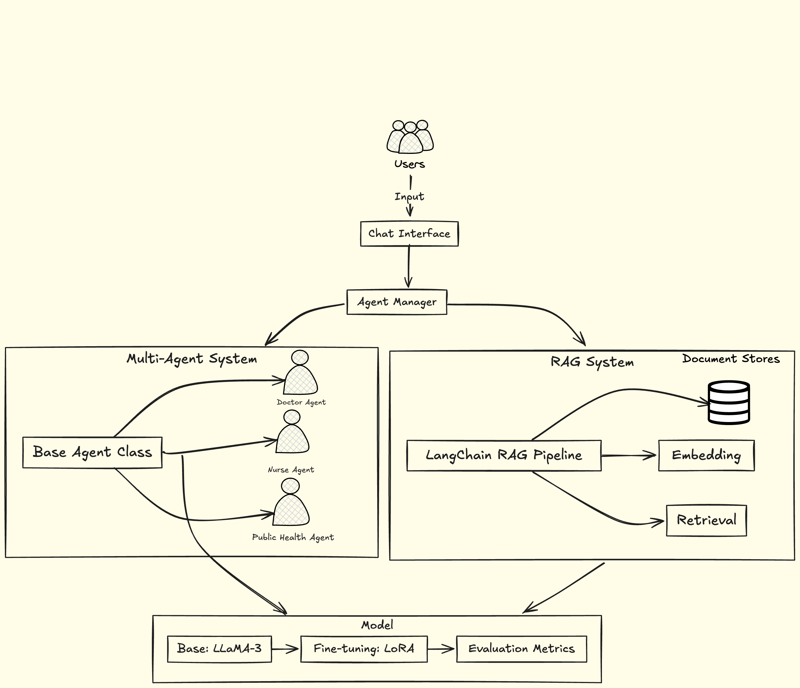
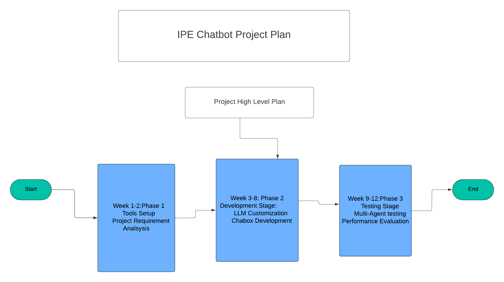

## Project: Group 6: IPE-Medical and Public Health
Title: Interprofessional Education(IPE): Medicine and Public Health

## Project Objectives:
The goal of this project is to design, develop, and validate a multi-agent chatbot that is capable of facilitating educational conversations representing diverse team members in typical medical setting. Interprofessional Education (IPE) is a collaborative method to develop students as future team members working with colleagues from different fields. IPE occurs when students from two or more professions learn about, from, and with each other. Specifically, the project will focus on:

Customizing an open-source LLM (e.g., LLaMA3) using Retrieval-Augmented Generation (RAG) and/or fine-tuning techniques (e.g., LoRA) to create a chatbot agents tailored for IPE experiences. Evaluating the chatbot's performance (e.g., adherence to instructions, depth of interactions, representation of professional fields) by simulating diverse student interactions using multiple LLM agents. Conducting user interface (UI) and usability testing to improve user experience. Optionally, integrating Learning Tools Interoperability (LTI) features to enable seamless usage in Learning Management Systems (LMS).

## System Architecture
 


## Project Approach:
The project will proceed in several phases:

 
Requirement Analysis: Collaborate with lead researchers to define key components of IPE experiences and specify chatbot performance requirements.

Development: Customize one or more open-source LLMs to create the initial version of the chatbot using RAG and fine-tuning methods.

Validation: Conduct multi-agent testing to evaluate the chatbot's performance across multiple medical/health domains and with varied inputs, focusing on metrics such as adherence to guidelines, professional field representations, and ability to stay on topic.

Usability Evaluation: Perform usability testing with end users, including metrics for user satisfaction, ease of use, and learning outcomes.

(Optional) Integration: Develop LTI integration to connect the chatbot with existing LMS tools to ensure accessibility for students in course environments.

## Folder Structure
___
- code
  - component: All classes and function needs to be here.
  - main_code: Main loop code needs to be here
- demo
  - fig
- research paper
  - Latex template
  - Word template
  - Markdown
- presentation
- full_report
  - Latex template
  - Word template
  - Markdown

```

├── code
│   ├── component
│   └── main_code
├── demo
│   └── fig
├── full_report
│   ├── Latex_report
│   │   └── fig
│   ├── Markdown_Report
│   └── Word_Report
├── presentation
└── research_paper
    ├── Latex
    │   └── Fig
    └── Word
```

___

## Contact
Author: Amir Jafari

Email: ajafari@gmail.com

GitHub: https://github.com/amir-jafari/Capstone


