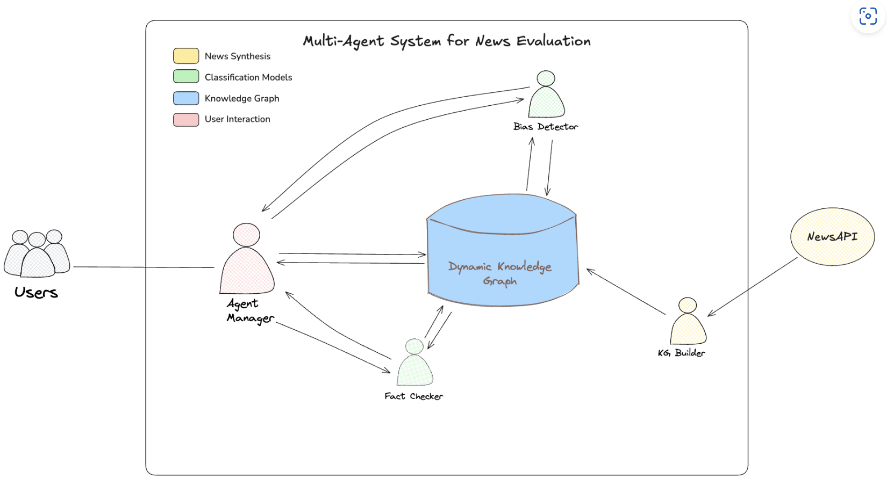
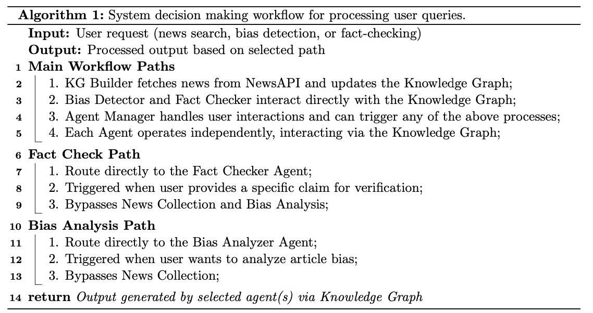
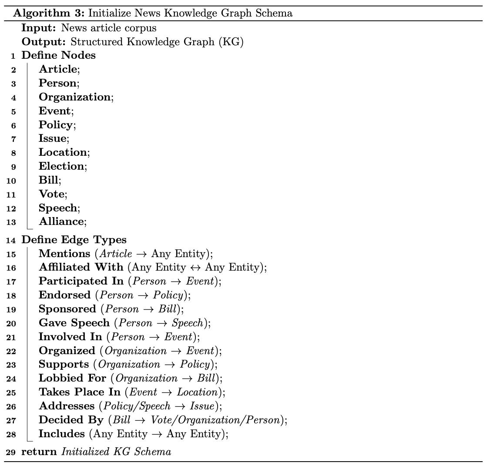
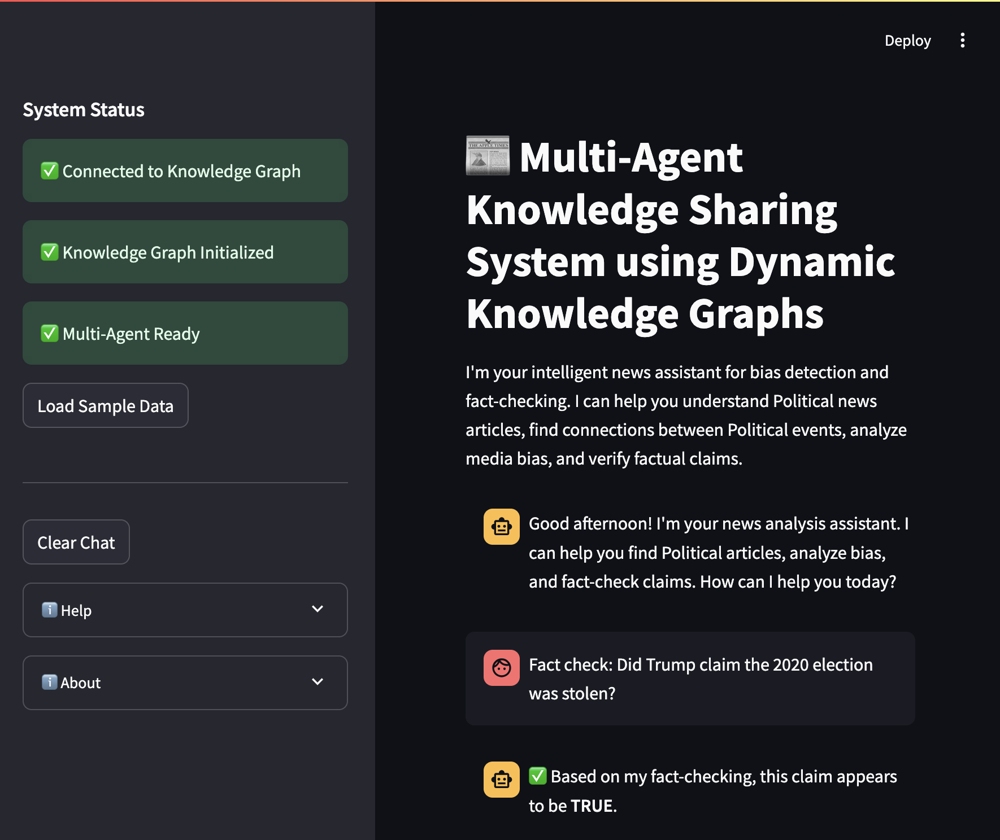

System Architecture
==================

Agent Structure
-------------
The system consists of several components that work together:

- **Knowledge Graph**: A Neo4j-based dynamic knowledge repository that stores news articles and entity relationships
- **Specialized Agents**:
  - **Bias Analyzer Agent**: Analyzes political news articles bias and leaning
  - **Fact Checker Agent**: Verifies factual claims against knowledge graph context and internal knowledge
- **Agent Manager**: Orchestrates workflow between agents, routes user requests to appropriate processing paths, returns consolidated results to the user interface

Integration Framework:
- **GraphState Schema**: Standardized data structure for agent communication
- **Streamlit UI**: User-friendly interface for interacting with the multi-agent system. This streamlined architecture enables efficient information sharing through the knowledge graph, allowing agents to leverage collaborative intelligence while maintaining specialized expertise in their respective domains.

   Multi-agent system architecture diagram

Workflow
--------

The system implements a flexible, knowledge-graph-centered architecture with specialized agents that operate independently but share information through a centralized knowledge repository.

- **Processing Route**:
The system supports three main processing routes based on the algorithm:

   Multi-agent system workflow

**Architecture Benefits**

- **Modular Design**: Agents function independently and can be developed/tested separately
- **Flexible Routing**: Multiple entry points based on user needs
- **Shared Knowledge**: Central knowledge graph eliminates redundant processing
- **Improved Performance**: Knowledge graph integration enhances accuracy compared to LLM-only approaches

**System Capabilities**

1. Fact-checking of direct user queries
2. Automated news collection and bias analysis
3. Persistent storage of analyzed articles in knowledge graph
4. Retrieval of balanced news perspectives

Knowledge Graph Workflow
-----------------------
Our system employs a dynamic knowledge graph for information storage and retrieval.

   Knowledge graph initialization and workflow

.. figure:: _static/images/graph_copy.png
   :alt: Knowledge Graph Structure
   :width: 800px

   Knowledge graph structure and relationships

User Interface
-------------

The system provides an intuitive user interface for interacting with the multi-agent system:

   Streamlit user interface for the multi-agent system

Tech Stack
---------
- **Large Language Models**: Claude 3 via AWS Bedrock
- **Knowledge Graph**: Neo4j
- **Backend**: Python
- **API Integration**: NewsAPI for article collection
- **Testing Framework**: Pytest