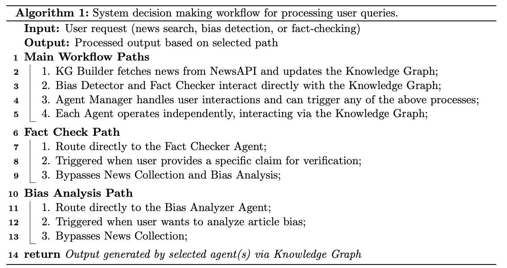
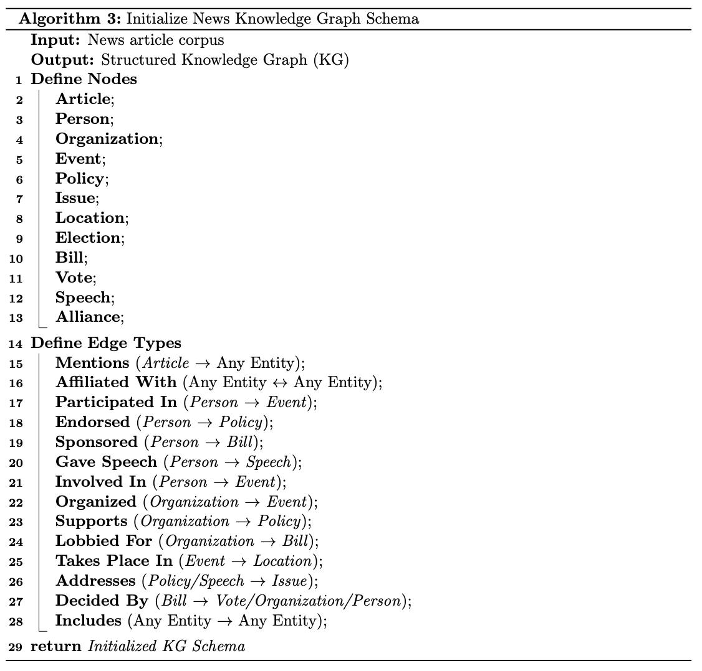
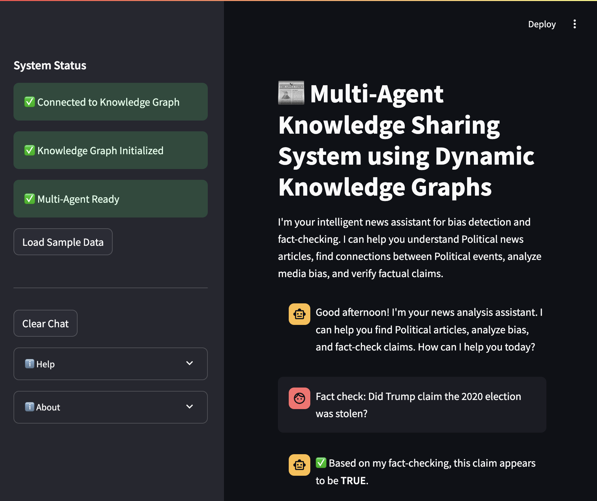
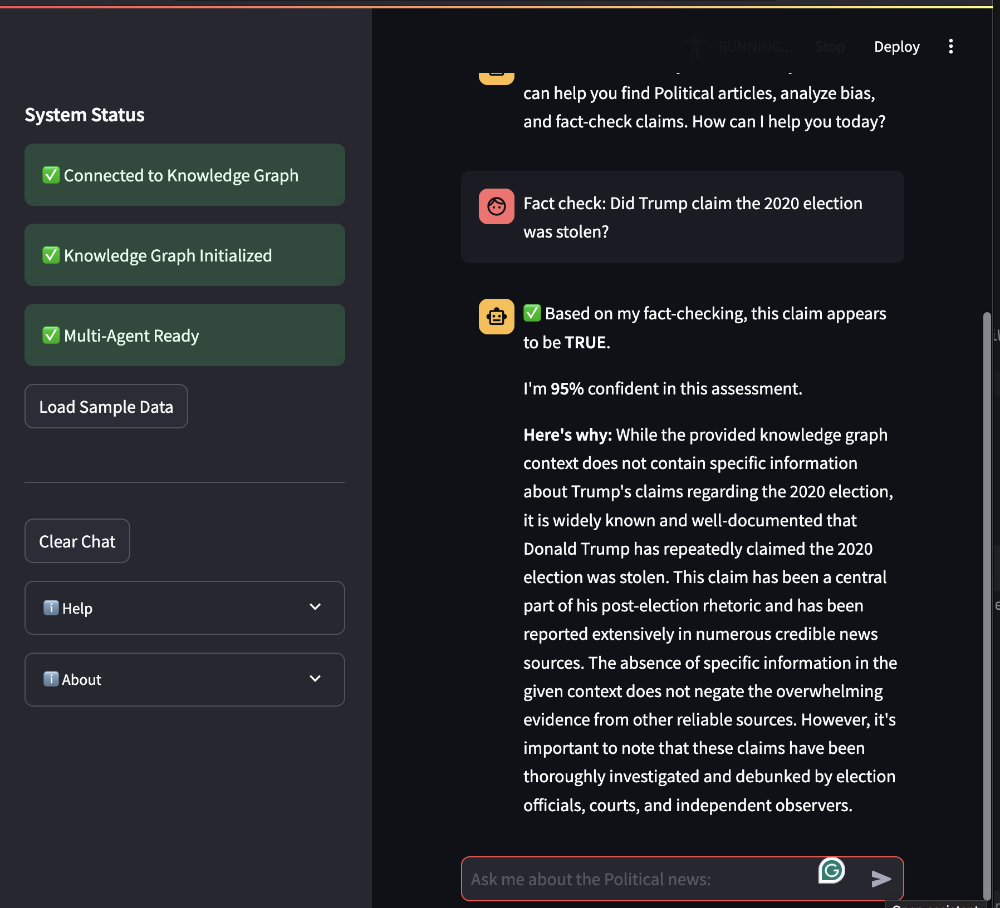

System Architecture
==================

Comparative System Architectures
--------------------------------

Our research compares three distinct architectural approaches:

**RAG Baseline (Unstructured Retrieval)**

* **Embedding**: Sentence-BERT (all-MiniLM-L6-v2) converts articles to vectors
* **Storage**: ChromaDB vector database
* **Retrieval**: Top-5 most similar articles via cosine similarity
* **Generation**: Mistral-7B-Instruct-v0.2 generates classification based on retrieved context

**LLM-Only (Direct Prompting)**

* **Model**: AWS Bedrock Claude 3.5 Sonnet v2
* **Approach**: Direct prompting without external knowledge
* **Memory**: No persistent storage or retrieval mechanism

**LLM+KG (Our System - Structured Knowledge)**

The system architectural design consists of several components that works in collaboration:

- **Knowledge Graph**: A Neo4j-based dynamic knowledge graph that stores news articles and entity relationships
- **Specialized Agents**:

  - **Bias Analyzer Agent**: Analyzes political news articles bias and leaning
  - **Fact Checker Agent**: functions in verification of factual claims against knowledge graph context and internal knowledge

- **Agent Manager**: Orchestrates workflow between agents, routes user requests/query to appropriate processing paths/channel, returns consolidated and results to the user interface

- **Integration Framework**:
- **GraphState Schema**: Standardized data structure for agent communication
- **Streamlit UI**: User-friendly interface for interacting with the multi-agent-KG system. This streamlined architecture enables efficient information sharing through the knowledge graph, allowing agents to leverage collaborative in storage intelligence while maintaining specialized expertise in their respective domains.
This streamlined architecture enables efficient information sharing through the knowledge graph, allowing agents to leverage collaborative intelligence while maintaining specialized expertise in their respective domains.

**Architectural Comparison**

.. list-table::
   :header-rows: 1
   :widths: 25 25 25 25

   * - Feature
     - RAG
     - LLM-only
     - LLM+KG
   * - Knowledge Structure
     - Unstructured vectors
     - No external knowledge
     - Structured graph
   * - Retrieval Method
     - Similarity search
     - None
     - Graph queries
   * - Reasoning
     - Limited
     - Strong
     - Strong + grounded
   * - Performance
     - Baseline
     - Good
     - **Best**

 System Architecture Diagram
----------------------------

.. figure:: _static/images/architecture.png
   :alt: System Architecture Diagram
   :width: 800px
   :align: center

   Multi-agent system architecture illustrating the Agent Manager coordinating specialized agents (Bias Detection and Fact-checker) that query a dynamic knowledge graph constructed from news articles

Workflow
--------

The LLM+KG system implements a flexible, knowledge-graph-centered architecture with specialized agents that operate independently but share information through a centralized knowledge graph.

Processing Routes
^^^^^^^^^^^^^^^^^

The system supports three main processing routes based on user needs:

1. **Full-Path**: Complete news analysis workflow

   - Collects news from external sources (NewsAPI)
   - Performs bias analysis and fact-checking
   - Updates knowledge graph with new information
   - Returns comprehensive analysis

2. **Fact-Check Path**: Direct claim verification

   - Bypasses news collection and bias analysis
   - Directly queries knowledge graph for relevant context
   - Verifies claims against stored information
   - Returns verification results with confidence scores

3. **Bias Analysis Path**: Focused bias assessment

   - Skips news collection when analyzing specific content
   - Queries knowledge graph for source and entity information
   - Updates knowledge graph with bias analysis results
   - Returns bias classification with supporting evidence

Main Processing Route of the System

   System workflow showing the three processing routes and agent interactions
   :width: 800px

Knowledge Graph Workflow
-----------------------
Our system employs a dynamic knowledge graph for information storage and retrieval.

   Knowledge graph initialization and workflow

.. figure:: _static/images/graph_copy.png
   :alt: Knowledge Graph Structure
   :width: 800px

   Knowledge graph structure and relationships

User Interface
-------------

The system provides an intuitive user interface for interacting with the multi-agent system:

Streamlit user interface for the multi-agent system

**Architecture Benefits**

**Modular Design**

- Agents function independently and interact with the knowledge graph
- Components can be developed and tested separately
- Easy to add new agents or modify existing ones

**Flexible Routing**

- Multiple entry points based on user needs
- Supports both comprehensive analysis and targeted queries
- Adapts processing path based on available information

**Shared Knowledge**

- Central knowledge graph eliminates redundant processing
- All agents access the same structured information
- Consistent context across different analysis tasks

**Improved Performance**

- Structured knowledge representation outperforms both unstructured retrieval (RAG) and direct prompting (LLM-only)
- Statistically significant improvements across all metrics (p < 0.01)
- Bias detection: 214% improvement over RAG, 26% over LLM-only
- Fact-checking: 20% improvement over RAG, 10% over LLM-only

System Capabilities
-------------------

1. **Fact-checking of direct user queries**: Verify claims against knowledge graph context
2. **Automated news collection and bias analysis**: Collect and analyze news articles automatically
3. **Persistent storage of analyzed articles**: Store results in knowledge graph for future reference
4. **Retrieval of balanced news perspectives**: Find articles across the political spectrum
5. **Dynamic knowledge updates**: Continuously update graph with new information
6. **Multi-agent coordination**: Specialized agents collaborate on complex tasks

Tech Stack
----------

**LLM+KG System:**

- **Large Language Model**: AWS Bedrock Claude 3.5 Sonnet v2
- **Knowledge Graph**: Neo4j database
- **Backend**: Python 3.12
- **Frameworks**: LangChain, LangChain-Neo4j, LangChain-experimental
- **API Integration**: NewsAPI for article collection
- **UI**: Streamlit for user interface
- **Testing Framework**: Pytest

**RAG Baseline:**

- **Generation Model**: Mistral-7B-Instruct-v0.2
- **Vector Database**: ChromaDB
- **Embedding Model**: Sentence-Transformers (all-MiniLM-L6-v2)
- **Backend**: Python 3.12

**LLM-Only Baseline:**

- **Model**: AWS Bedrock Claude 3.5 Sonnet v2
- **Backend**: Python 3.12