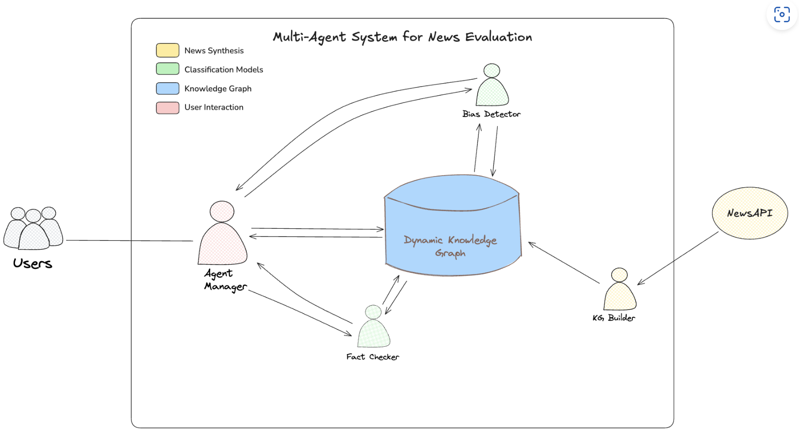

Improved Multi-Agent Knowledge Sharing System
==========================================

A multi-agent chatbot system for detecting media bias in news articles and providing unbiased summaries.

.. toctree::
   :maxdepth: 2
   :caption: Contents:

   introduction
   installation
   architecture
   modules
   development
   research

Project Overview
---------------
This project implements a multi-agent with integrated dynamic KG system capable of detecting media bias in news articles and providing unbiased summaries. The system utilizes multiple specialized agents for tasks such as bias detection, fact-checking, and knowledge graph maintenance.

Key Features
-----------
* Multi-agent system with Structure knowledge graph
* Three-way comparison:  RAG vs. LLM-only VS LLM+KG
* Dynamic knowledge graph integration
* Specialized Bias detection and analysis agent
* Specialized Fact_checking agent
* Statistical validation with McNemar's test

System Architecture
-----------------
The system consists of several specialized agents:

    Multi-agent system architecture diagram

- **Knowledge Graph** : A Neo4j-based dynamic knowledge graph that stores news articles and entity relationships
- **Specialized Agents** : Bias Analyzer Agent : Analyzes political news articles bias and leaning
- **Fact Checker Agent** : Verifies factual claims against knowledge graph context and internal knowledge
- **Agent Manager** :Orchestrates workflow between agents Routes user requests to appropriate processing paths Returns consolidated results to the user interface

** Integration Framework**:

- **GraphState Schema**: Standardized data structure for agent communication

- **Streamlit UI**: User-friendly interface for interacting with the multi-agent system. This streamlined architecture enables efficient information sharing through the knowledge graph, allowing agents to leverage collaborative intelligence also maintaining specialized expertise in their respective domains.

Key Findings
-----------
Our experiments demonstrate that structured knowledge graph integration significantly outperforms both unstructured retrieval (RAG) and direct LLM prompting:

**Bias Detection (Weighted F1):**

* RAG Baseline: 0.287
* LLM-only: 0.713
* **LLM+KG: 0.901** (214% improvement over RAG, 26% over LLM-only)

**Fact-Checking (Weighted F1):**

* RAG Baseline: 0.661
* LLM-only: 0.721
* **LLM+KG: 0.794** (20% improvement over RAG, 10% over LLM-only)

All improvements are statistically significant (p < 0.01) based on McNemar's test with bootstrap confidence intervals.

Tech Stack
----------
* Python
* Streamlit
* Large Language Models**: Claude 3 via AWS Bedrock
* Neo4j
* Pytest

Project Folder Structure
--------------
.. code-block:: text

    project_root/
    ├── src/
    │   ├── component/
    │   │   ├── bias_analyzer_agent/
    │   │   ├── fact_checker_agent/
    │   │   ├── KG Builder/
    │   │   └── agent_manager/
    │   │       ├── manager.py
    │   │       └── transistion.py
    │   ├── memory/
    │   │   ├── knowledge_graph/
    │   │   ├── schema/
    │   │   └── state/
    │   ├── util/
    │   │   └── aws_helperfunction/
    │   ├── workflow/
    │   │   ├── config.py
    │   │   ├── graph.py
    │   │   └── simplified_workflow/
    │   └── ui/
    │       └── streamlit/
    │           └── chatbot_ui.py
    │
    ├── system_evaluation/
    │   ├── result/
    │   ├── test_dataset/
    │   ├── evaluate.py
    │   ├── metrics_updated.py
    │   └── visualization_updated.py
    ├── unit_tests_v2/
    │   ├── test_api_keys.py
    │   ├── test_bias_analyzer.py
    │   ├── test_fact_checking.py
    │   ├── test_fact_kg_builder.py
    │   └── test_bedrock_setup.py
    ├── docs/
    ├── project_proposal/
    ├── research_paper/
    │   ├── latex/
    │   │   └── fig/
    │   └── word/
    ├── assets/
    │   └── fig/
    ├── reports/
    │   ├── latex_report/
    │   │   └── fig/
    │   ├── markdown_report/
    │   └── word_report/
    └── presentations/
        └── preliminary_findings/Development Guide
================

Contact Information
------------------
| **Advisor:** Amir Jafari
| **Email:** ajafari@gmail.com
| **Institution:** The George Washington University, Washington DC
| **Program:** Data Science
| **GitHub:** https://github.com/amir-jafari/Capstone

Team Members
-----------
* Modupeola Fagbenro
* Christopher Washer
* Chella Pavani

Indices and tables
==================

* :ref:`genindex`
* :ref:`modindex`
* :ref:`search`